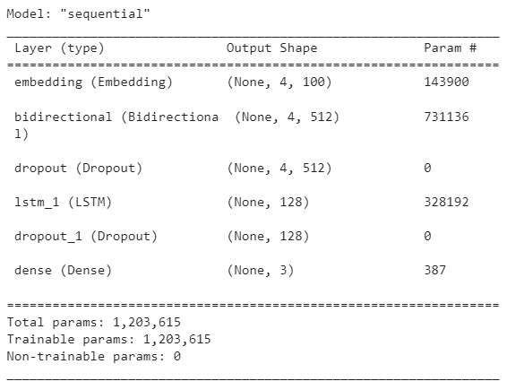
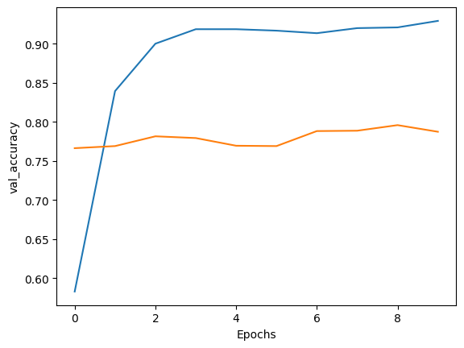
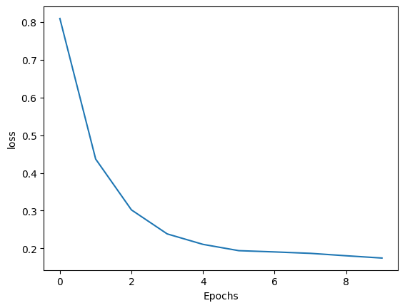

# MACHINE LEARNING

## Overview

The machine Learning part of this application is a recommendation system. We create a model for an article recommendation system that classifies fire, criminal, and health-related topics. The readers' read data is sent to the cloud and the title of the articles will be processed in the model. After that, based on what the user has read, the model will recommend appropriate categories.

## Datasets

The dataset we use comes from [CNN Indonesia][cnn-id] (train and validation data) and [Kompas.com][kompas-id] (for testing). We collect the article title, author, category, article link, image link, and some content from the article. To retrieve these datasets, we use two methods:

1. HTML parser [Beautiful Soup][beautiful-soup]
2. Automates web browser [Selenium][selenium]

We take the html tags that store the data such as `<h1>` and `<h2>` for the title,`
` the content, `<a>` tags for the article links, and `` which holds the image links. The scrapped data is then stored in CSV format.
For more details visit [datasets][link-id].

## Model Architecture

1.  We use the [Embedding Layer][embedding] to convert the words into a numerical representation. Each word will be represented with a word space vector.
2.  [Bidirectional LSTM layer][bidirectional]. LSTM is a type of recurrence model that can overcome the vanishing gradient problem in artificial neural networks.
3.  [Dropout Layer][dropout] is used to avoid overfitting in the model.

The model achieved a loss of 0.1744 and an accuracy of 0.9292 on the training data. While in the validation data, the model achieved a loss of 0.6373 and an accuracy of 0.7874.

Model Summary

Model Accuracy & Loss

## How to replicate our projects

### 01 Data Preprocessing

To run this model you need to follow these steps:

- Download the datasets [here][link-id]
- Upload the dataset in your notebook environment
- Install the required libraries
- Pre-process the data

### 02 Modelling

- Tokenize to vectorize the text corpus
- Build and compile the model with the architectures as mentioned [above](#model-architecture)
- Do a model evaluation
- Convert the model to `.h5` format

[cnn-id]: https://www.cnnindonesia.com
[kompas-id]: https://www.kompas.com
[link-id]: https://github.com/EmergenZ-Team/EmergenZ-ML/tree/main/datasets
[beautiful-soup]: https://www.crummy.com/software/BeautifulSoup/bs4/doc/
[selenium]: https://www.selenium.dev
[embedding]: https://www.tensorflow.org/api_docs/python/tf/keras/layers/Embedding
[bidirectional]: https://www.tensorflow.org/api_docs/python/tf/keras/layers/Bidirectional
[dropout]: https://www.tensorflow.org/api_docs/python/tf/keras/layers/Dropout
